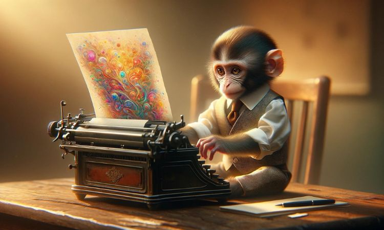

# Lenguaje de Marcas

__Lenguajes de marcas__ _más utilizados_ 
* XML
* HTML
* MARKDONW

| Nombre | Edad |
|--------|------|
|Samuel  |   18 |
|Miguel|16|
|Raul|02|

[Apuntes](https://github.com/jonaygarciav/apuntes_de_lnd/blob/main/apuntes/ut01/introduccion-a-los-lenguajes-de-marcas.md)
